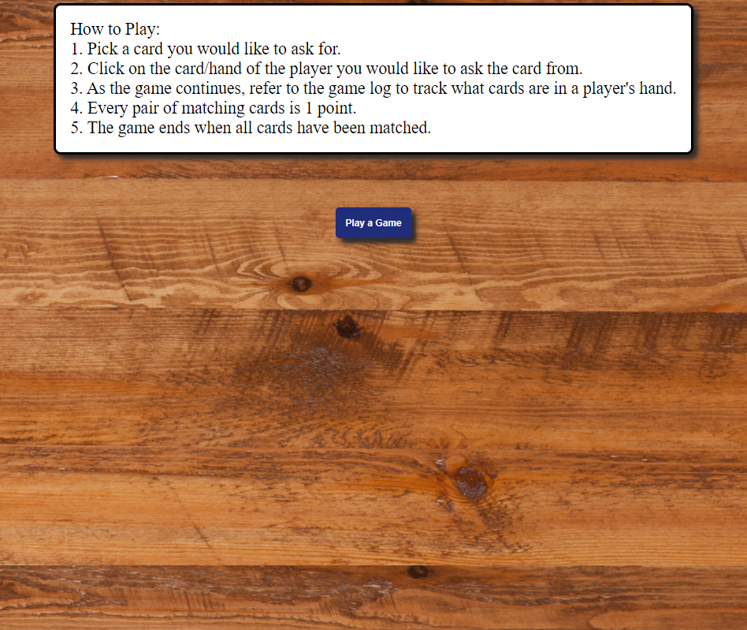
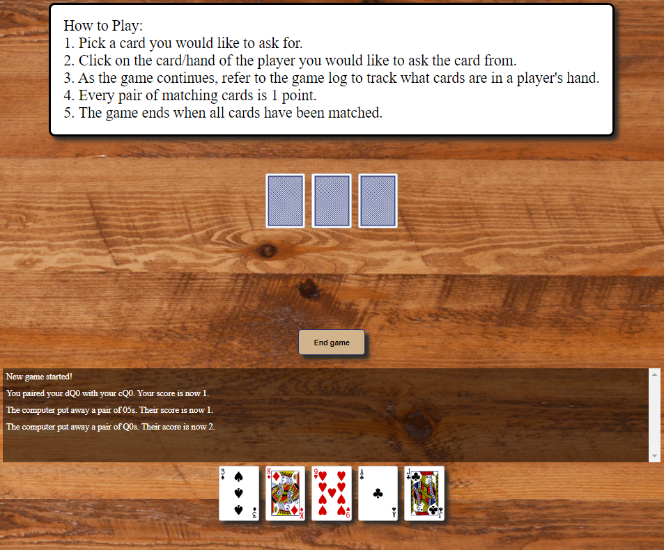

# Go Fish

This is a simple game of Go Fish with a computer as a game partner. This game includes basic AI logic. As you click through your cards you can rely on the message display to update what cards are potentially still in the computer's hand.

Now that it is complete, I am thrilled with the prospect of game development and understanding the underlying steps and functions that create a single interaction between a user and the background code.

## Getting started

[~ Click here and test out the game yourself ~](https://tungm92.github.io/go-fish/)

Directions are included at the top of the game. You can forfeit the game at any time and start over. With 26 possible pairs, all you need is 14 points to make sure you win!

## Attributions

Cards were courtesy of General Assembly's previous modules [(link)](https://git.generalassemb.ly/modular-curriculum-all-courses/card-game-starter-code/tree/main/images).

Shuffle logic from stackoverflow users Laurens Holt and ashleedawg [(link)](https://stackoverflow.com/questions/2450954/how-to-randomize-shuffle-a-javascript-array).

The removePairs function is co-authored with the generous support of lorenzoesparesdev. Without his guidance in reading coding, placing effective console logs, and trust in my growth I would not have been able to take this exercise to develop the rest of the code.

## Tech used

* HTML
* JavaScript
* CSS

## Next steps

Now that the basic code and game logic is fulfilled, the user experience is next. Without animations, pauses between steps, and sound, the game is very bare and lacking in a more immersive user experience.

Eventually, this game will have the option to pick a the number of players.

Ideally, this game will provide a baseline for multiple other card games with greater complexity such as Old Maid and Thirteen.